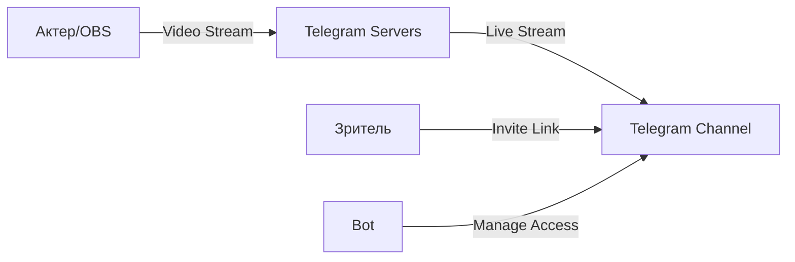
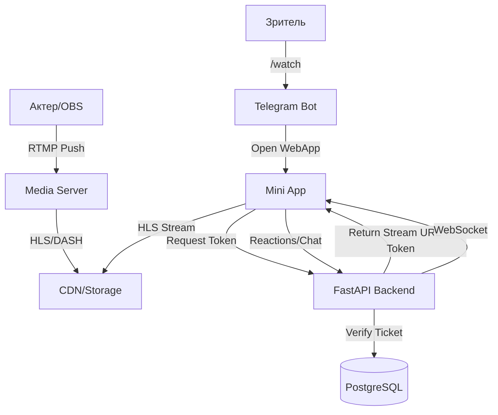
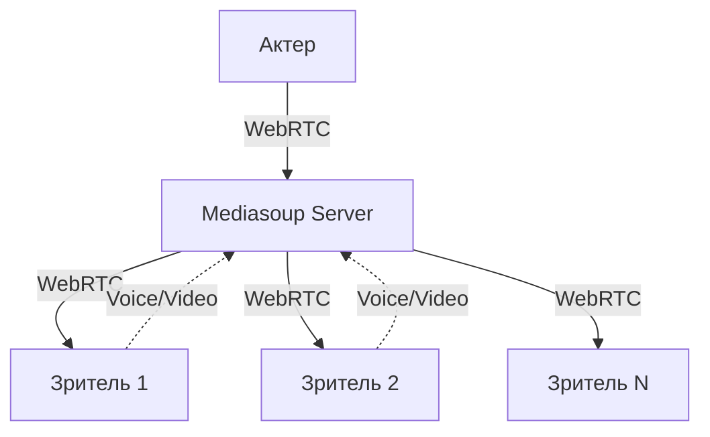
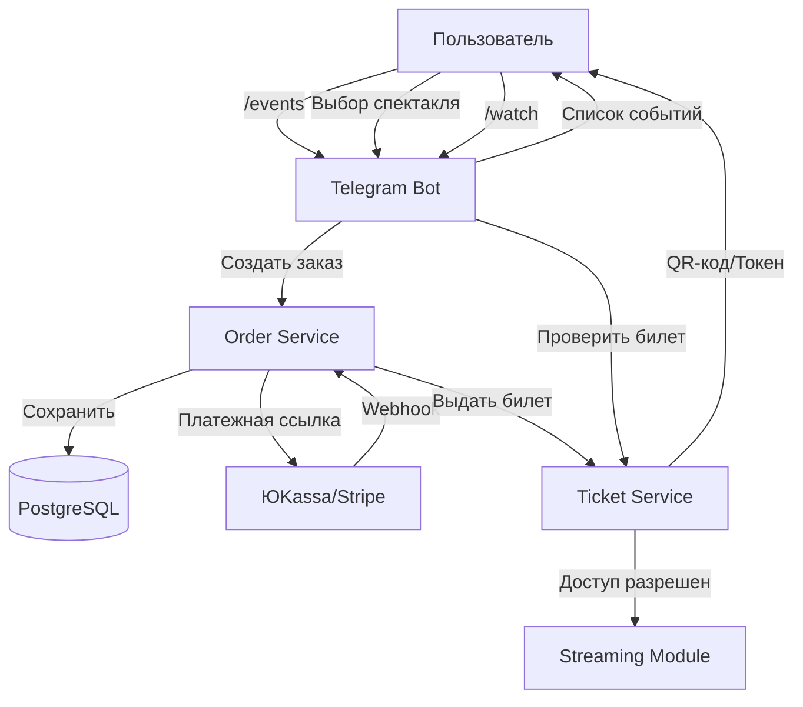
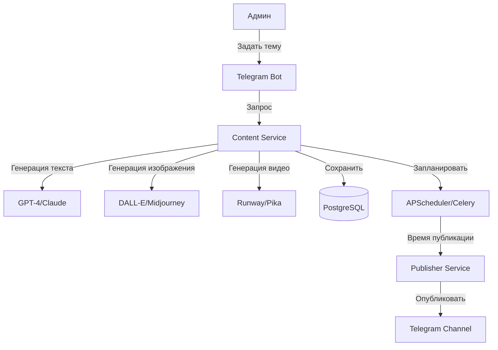
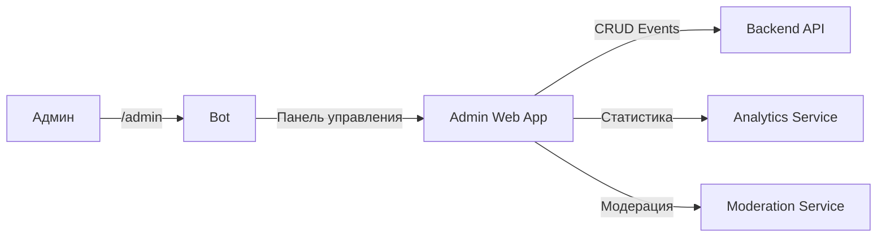
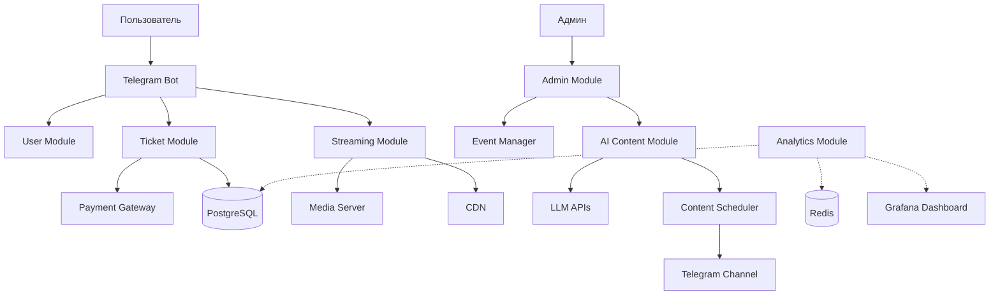

# Архитектура Модулей: Детальная Документация

## Обзор Модульной Структуры

Система построена по принципу микросервисной архитектуры с четким разделением ответственности между модулями.

---

## 1. Модуль Трансляций (Streaming Module)

### Назначение
Обеспечение прямых трансляций спектаклей с контролем доступа и интерактивными возможностями.

### Варианты Реализации

#### Вариант A: Telegram Native Streaming


**Компоненты:**
- Telegram Live Streams API
- Управление приглашениями через бота
- Нативный плеер Telegram

**Плюсы:**
- ✅ Бесплатно
- ✅ Нет задержек
- ✅ Работает в приложении
- ✅ Быстрая реализация (1-2 недели)

**Минусы:**
- ❌ Ограниченная монетизация
- ❌ Нет кастомного UI
- ❌ Зависимость от Telegram

**Технологический стек:**
- Aiogram 3.x (управление доступом)
- Telegram Bot API
- PostgreSQL (учет билетов)

---

#### Вариант B: Web App + External Streaming (РЕКОМЕНДУЕТСЯ)


**Компоненты:**

1. **Media Server** (выбор):
   - **SRS (Simple Realtime Server)** - open-source, легкий
   - **Nginx-RTMP** - проверенный, стабильный
   - **Cloud (Mux/AWS IVS)** - дорого, но надежно

2. **Frontend (Telegram Mini App)**:
   - React/Vue.js
   - Video.js / HLS.js (плеер)
   - WebSocket для чата

3. **Backend API**:
   - FastAPI (Python)
   - JWT токены для доступа
   - Redis для сессий

**Плюсы:**
- ✅ Полный контроль доступа
- ✅ Кастомный UI/UX
- ✅ Интерактив (реакции, донаты)
- ✅ Профессиональное качество
- ✅ Аналитика просмотров

**Минусы:**
- ❌ Сложнее в реализации (4-6 недель)
- ❌ Требуется сервер/CDN
- ❌ Выше стоимость инфраструктуры

**Технологический стек:**
- **Стриминг**: SRS / Nginx-RTMP
- **Frontend**: React + Video.js
- **Backend**: FastAPI + PostgreSQL + Redis
- **CDN**: Cloudflare Stream / AWS CloudFront

---

#### Вариант C: WebRTC (Интерактивный Театр)


**Когда использовать:**
- Иммерсивный театр (зрители участвуют)
- Мастер-классы с обратной связью
- Небольшие камерные постановки (<100 зрителей)

**Плюсы:**
- ✅ Минимальная задержка (<500мс)
- ✅ Двусторонняя связь
- ✅ Высокая интерактивность

**Минусы:**
- ❌ Дорого масштабировать
- ❌ Сложная инфраструктура
- ❌ Требует мощные серверы

**Технологический стек:**
- Mediasoup (Node.js)
- WebRTC
- TURN/STUN серверы

---

### Рекомендация по Выбору

| Критерий | Вариант A | Вариант B | Вариант C |
|----------|-----------|-----------|-----------|
| Стоимость разработки | 💰 | 💰💰💰 | 💰💰💰💰 |
| Время до MVP | 1-2 недели | 4-6 недель | 8-12 недель |
| Монетизация | ⭐⭐ | ⭐⭐⭐⭐⭐ | ⭐⭐⭐⭐ |
| Масштабируемость | ⭐⭐⭐⭐⭐ | ⭐⭐⭐⭐ | ⭐⭐ |
| Качество | ⭐⭐⭐⭐ | ⭐⭐⭐⭐⭐ | ⭐⭐⭐⭐⭐ |
| Интерактивность | ⭐⭐ | ⭐⭐⭐⭐ | ⭐⭐⭐⭐⭐ |

**Стратегия:** Начать с **Варианта A** для MVP, затем мигрировать на **Вариант B** для профессионального продукта.

---

## 2. Модуль Билетной Системы (Ticketing Module)

### Назначение
Продажа, проверка и управление доступом к мероприятиям.

### Архитектура



### Компоненты

#### 2.1. Order Service (Сервис Заказов)
**Ответственность:**
- Создание заказов
- Расчет стоимости (скидки, промокоды)
- Интеграция с платежными системами

**База данных:**
```sql
-- Таблица событий
CREATE TABLE events (
    id SERIAL PRIMARY KEY,
    title VARCHAR(255) NOT NULL,
    description TEXT,
    start_time TIMESTAMP NOT NULL,
    duration_minutes INT,
    price DECIMAL(10,2),
    max_viewers INT,
    stream_url VARCHAR(500),
    status VARCHAR(50) -- upcoming, live, finished
);

-- Таблица заказов
CREATE TABLE orders (
    id SERIAL PRIMARY KEY,
    user_id BIGINT NOT NULL,
    event_id INT REFERENCES events(id),
    amount DECIMAL(10,2),
    status VARCHAR(50), -- pending, paid, cancelled
    payment_id VARCHAR(255),
    created_at TIMESTAMP DEFAULT NOW()
);

-- Таблица билетов
CREATE TABLE tickets (
    id SERIAL PRIMARY KEY,
    order_id INT REFERENCES orders(id),
    user_id BIGINT NOT NULL,
    event_id INT REFERENCES events(id),
    access_token VARCHAR(255) UNIQUE,
    qr_code TEXT,
    is_used BOOLEAN DEFAULT FALSE,
    created_at TIMESTAMP DEFAULT NOW()
);
```

#### 2.2. Ticket Service (Сервис Билетов)
**Ответственность:**
- Генерация уникальных токенов доступа
- Проверка валидности билетов
- Отзыв доступа (возврат билетов)

**API Endpoints:**
```python
# FastAPI примеры
@router.post("/tickets/validate")
async def validate_ticket(token: str, event_id: int):
    """Проверка билета перед доступом к трансляции"""
    pass

@router.post("/tickets/generate")
async def generate_ticket(order_id: int):
    """Генерация билета после оплаты"""
    pass
```

### Варианты Платежных Систем

| Система | Комиссия | Интеграция | Поддержка РФ |
|---------|----------|------------|--------------|
| ЮKassa | 2.8% + 10₽ | ⭐⭐⭐⭐⭐ | ✅ |
| Stripe | 2.9% + $0.30 | ⭐⭐⭐⭐ | ❌ |
| Telegram Stars | ~30% | ⭐⭐⭐⭐⭐ | ✅ |
| Криптовалюта | 0-1% | ⭐⭐⭐ | ✅ |

**Рекомендация:** ЮKassa для РФ, Telegram Stars для простоты.

---

## 3. Модуль ИИ-Контента (AI Content Module)

### Назначение
Автоматическая генерация и публикация контента для продвижения спектаклей.

### Архитектура



### Компоненты

#### 3.1. Content Generator
**Возможности:**
- Генерация анонсов спектаклей
- Создание промо-постов
- Генерация изображений для афиш
- Создание коротких видео-тизеров

**Интеграции:**
```python
# Примеры интеграций
class AIContentGenerator:
    async def generate_announcement(self, event: Event) -> str:
        """Генерация текста анонса через GPT-4"""
        pass
    
    async def generate_poster(self, prompt: str) -> bytes:
        """Генерация афиши через DALL-E"""
        pass
    
    async def generate_teaser(self, script: str) -> str:
        """Генерация видео через Runway API"""
        pass
```

#### 3.2. Content Scheduler
**Функции:**
- Планирование публикаций
- Автоматический постинг
- A/B тестирование контента

**База данных:**
```sql
CREATE TABLE content_queue (
    id SERIAL PRIMARY KEY,
    content_type VARCHAR(50), -- text, image, video
    content_data JSONB,
    scheduled_time TIMESTAMP,
    status VARCHAR(50), -- pending, published, failed
    channel_id BIGINT,
    created_at TIMESTAMP DEFAULT NOW()
);
```

### Варианты ИИ-Сервисов

| Сервис | Тип | Стоимость | Качество |
|--------|-----|-----------|----------|
| GPT-4 | Текст | $0.03/1K токенов | ⭐⭐⭐⭐⭐ |
| Claude 3.5 | Текст | $0.015/1K токенов | ⭐⭐⭐⭐⭐ |
| DALL-E 3 | Изображения | $0.04/изображение | ⭐⭐⭐⭐ |
| Midjourney | Изображения | $10-60/мес | ⭐⭐⭐⭐⭐ |
| Runway Gen-3 | Видео | $0.05/сек | ⭐⭐⭐⭐ |

---

## 4. Модуль Пользователей (User Module)

### Назначение
Управление профилями, подписками, историей покупок.

### Схема БД

```sql
CREATE TABLE users (
    telegram_id BIGINT PRIMARY KEY,
    username VARCHAR(255),
    first_name VARCHAR(255),
    last_name VARCHAR(255),
    language_code VARCHAR(10) DEFAULT 'ru',
    is_premium BOOLEAN DEFAULT FALSE,
    balance DECIMAL(10,2) DEFAULT 0,
    created_at TIMESTAMP DEFAULT NOW(),
    last_active TIMESTAMP
);

CREATE TABLE user_subscriptions (
    id SERIAL PRIMARY KEY,
    user_id BIGINT REFERENCES users(telegram_id),
    subscription_type VARCHAR(50), -- monthly, yearly
    start_date TIMESTAMP,
    end_date TIMESTAMP,
    is_active BOOLEAN DEFAULT TRUE
);

CREATE TABLE user_history (
    id SERIAL PRIMARY KEY,
    user_id BIGINT REFERENCES users(telegram_id),
    event_id INT REFERENCES events(id),
    watched_at TIMESTAMP,
    watch_duration_minutes INT,
    rating INT CHECK (rating BETWEEN 1 AND 5)
);
```

---

## 5. Модуль Администрирования (Admin Module)

### Функции
- Создание и редактирование событий
- Управление доступом
- Модерация контента
- Просмотр статистики

### Интерфейс


---

## 6. Модуль Аналитики (Analytics Module)

### Метрики

**Для трансляций:**
- Количество зрителей (текущее/пиковое)
- Средняя длительность просмотра
- География зрителей
- Качество соединения

**Для продаж:**
- Конверсия в покупку
- Средний чек
- Популярные события
- Эффективность промокодов

**Для контента:**
- Охват постов
- Вовлеченность (лайки, комментарии)
- Эффективность ИИ-контента

### Технологии
- PostgreSQL (хранение)
- Redis (real-time метрики)
- Grafana (визуализация)

---

## Общая Диаграмма Взаимодействия Модулей



---

## Следующие Шаги

1. **Выбор варианта стриминга** (A, B или C)
2. **Детализация схемы БД** для выбранного варианта
3. **Проектирование API** для всех модулей
4. **Создание прототипа** одного модуля для тестирования
